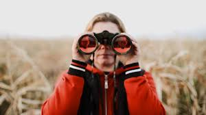

# Local Observations Backend

**Note: this is not a fully-populated repo-- it is specific for one purpose: to provide streaming data for use with a React front-end in a related repo**

See related repo here: [local_observations_frontend](https://github.com/ErikPohl444/local_observations_frontend)

A Python Flask application serving as a toy-controlled streaming-data server for use with the **local_observations_frontend** repository.
This backend streaming server serves up streaming data concocted from iNaturalist observation data from the past 24 hours for an area within a 25-mile radius of Arlingon, MA.
However, key elements of the search can be changed by altering the contents of the config.json file.

## Features

- **Streaming Endpoint**: Provides a streaming API for real-time data consumption.
- **Integration Ready**: Designed specifically to work with the [local_observations_frontend](https://github.com/ErikPohl444/local_observations_frontend) repository.
- **Python Flask Backend**: Lightweight and easy to extend for custom use cases.

## Prerequisites

- Python 3.8 or higher
- Flask library

## Installing

1. Clone the repository:
   ```bash
   git clone https://github.com/ErikPohl444/local_observations_backend.git
   cd local_observations_backend
   ```

2. Install dependencies:
   ```bash
   pip install -r requirements.txt
   ```

3. Run the application:
   ```bash
   python app.py
   ```

## Running the Tests

(To be added) Instructions on running automated tests for the backend.

## Contributing

Contributions are welcome! Feel free to open issues or submit pull requests. For now, there are no strict contribution guidelines.

## Authors

- **Erik Pohl** - *Initial work*

Also, see the list of [contributors](https://github.com/ErikPohl444/local_observations_backend/graphs/contributors) who participated in this project.

## License

This project is licensed under the MIT License - see the [LICENSE.md](LICENSE.md) file for details.

## Acknowledgments

- Inspiration and motivation come from everyone who encourages learning and exploration.
